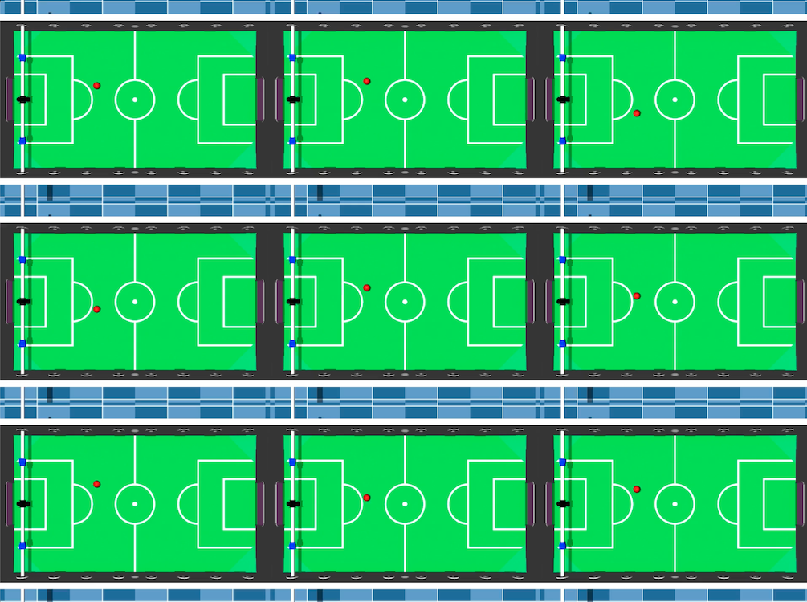

# FoosballRL

#### Train a Foosball-Agent using Deep Reinforcement Learning

This is an exercise for students to train a goalie in a foosball environment using Python.
The environment is based on a to-scale mujoco model of a foosball table.
Students are encouraged to experiment with different RL-algorithms and observe their performance.
This project provides built-in support for RL-algorithms
from [stable-baselines3](https://github.com/DLR-RM/stable-baselines3)
and [stable-baselines3-contrib](https://github.com/Stable-Baselines-Team/stable-baselines3-contrib).
Video recording and multi-env training are also built-in. The training process can be monitored using tensorboard and
watched
live using an interactive viewer. The tensorboard-results of multiple training runs are aggregated.

| Foosball Environment                                 | Multi-Environment Training                                   |
|------------------------------------------------------|--------------------------------------------------------------|
|  |  |

## Installing

Navigate to the project directory and install the required Python packages.

```bash
pip install -r requirements.txt
```

## Running the Project

The main entry point of the project is `foosball_rl/__main__.py`. This script reads the run-configuration
from `foosball_rl/run_config.yml`, and either starts training or evaluating a model.
One run will train multiple different models with the same configuration but different random-seeds, which can be set in
the `foosball_rl/run_config.yml`, and save the results in the `experiments` directory.

Before training: Make sure to set the `experiment_name` in the `foosball_rl/run_config.yml` file to a unique name for
the current experiment. While nothing will be overridden if forgotten, a new directory with an added timestamp will be
created for each run.


```bash
python3 -m foosball_rl
```

After the training process is finished, the aggregated results can be viewed using tensorboard.

```bash
tensorboard --logdir ./experiments/{experiment_name}/training/tensorboard/aggregates
```

Make sure to replace `{experiment_name}` with the name of the experiment you want to view.
You can also view the results of a single run by replacing `aggregates` with `training_run_seed_{seed}_{run-id}` of the
run you want to view.

## Configuration

The project consists of multiple configuration files, namely:

- `foosball_rl/run_config.yml`: The run configuration contains multiple sections which define different aspects of the
  experiment. Please refer to
  the [Run_config README file](https://github.com/kitaird/FoosballRL/blob/develop/foosball_rl/README.md).
- `foosball_rl/algorithms/hyperparameter.yml`: The hyperparameters for the supported training algorithms. Here, students
  can experiment with different hyperparameter-settings for different runs. Please refer to
  the [Hyperparameter README file](https://github.com/kitaird/FoosballRL/blob/develop/foosball_rl/algorithms/README.md).
- `foosball_rl/environments/goalkeeper/goalkeeper-config.yml`: The environment configuration for the foosball table with
  only one goalkeeper rod. Each environment config contains also the episode definition, which can also be changed for
  different initial state distributions. For more information please check
  the [Environments README file](https://github.com/kitaird/FoosballRL/blob/develop/foosball_rl/environments/README.md).
- `foosball_rl/environments/foosball/single_agent/foosball-config.yml`: The environment configuration for the whole
  foosball table with all players, analogously to the goalkeeper environment.
- `foosball_rl/utils/logging.yml`: Logging settings for the project.

## Environments

This project supports two environment configurations: `Goalkeeper-v0` and `Foosball-v0`.
The `Goalkeeper-v0` environment is a simplified version of the `Foosball-v0` environment, where only the goalie is
present.
The `Foosball-v0` environment is the full foosball table with all players.
The environment interfaces are defined in the directories of each scenario.

The objectives of each configuration is defined in the respective README files
under [Goalkeeper README file](https://github.com/kitaird/FoosballRL/blob/develop/environments/goalkeeper/README.md)
or [Foosball README file](https://github.com/kitaird/FoosballRL/blob/develop/environments/foosball/README.md) and
The results of each training run are saved in the `experiments` directory, with a snapshot of the used configuration
files.

## Wrapper

Besides the wrappers from [stable-baselines3](https://github.com/DLR-RM/stable-baselines3), the project provides
additional wrappers in the `foosball_rl/environments/common` directory, namely:

- `GoalEnvWrapper`: Modifies the environment to be compatible with the `GoalEnv` interface for the usage of Hindsight
  Experience Replay (HerReplayBuffer from [stable-baselines3](https://github.com/DLR-RM/stable-baselines3)).
- `AddActionToObservationsWrapper`: Adds the last performed actions to the observation.
- `DiscreteActionWrapper`: Bins the action space into a single dimension, using the binning parameters defined in the
  `foosball_rl/run_config.yml`.
- `MultiDiscreteActionWrapper`: Bins the action space into two dimensions, using the binning parameters defined in the
  `foosball_rl/run_config.yml`.
- `VecPBRSWrapper`: An implementation of potential-based reward shaping (PBRS) for the foosball environment. See Ng, A.
  Y., Harada, D., & Russell, S. (1999, June). Policy invariance under reward transformations: Theory and application to
  reward shaping. In Icml (Vol. 99, pp. 278-287).
